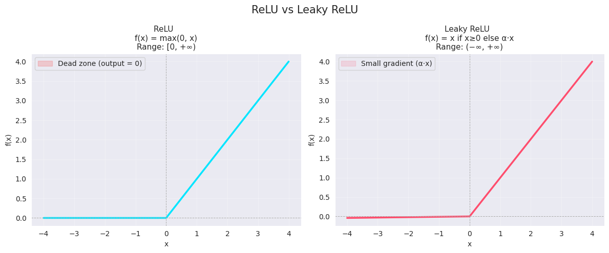
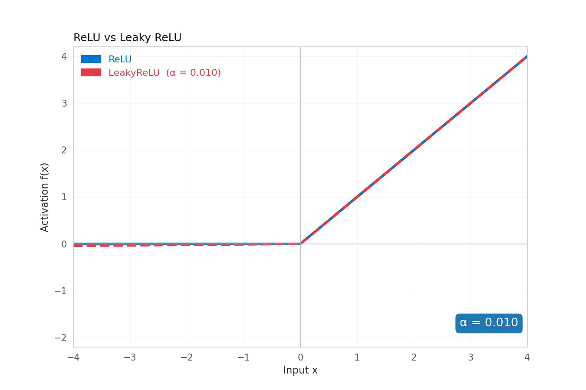

# ReLU vs Leaky ReLU

This repo explores two of the most widely used activation functions in deep learning: ReLU and Leaky ReLU. The goal is not just to plot them but to actually understand *why* Leaky ReLU exists, what problem it solves, and when you should reach for one over the other.

## What even is an activation function?

A neural network without activation functions is just matrix multiplication stacked on top of more matrix multiplication. No matter how many layers you add, the whole thing collapses into a single linear transformation. Activation functions break that linearity. They let networks learn curves, edges, hierarchies, and all the things that make deep learning actually useful.

## ReLU (Rectified Linear Unit)



ReLU is about as simple as it gets.

```
f(x) = max(0, x)
```

If the input is positive, pass it through. If it's negative, output zero. That's it.

**Gradient**
```
f'(x) = 1    if x > 0
f'(x) = 0    if x <= 0
```

**Range:** [0, +∞)

ReLU became the go-to activation function because it's cheap to compute, it doesn't saturate on the positive side, and it tends to produce sparse activations where only a subset of neurons fire at once. That sparsity is actually useful. It acts like a natural regulariser and makes the network more efficient.

### The dying neuron problem

Here's where ReLU has a real flaw. If a neuron receives a large negative input, say after a bad weight update or with a high learning rate, its output becomes zero. The gradient is also zero. Backpropagation has nothing to work with, so the weights never update. The neuron is stuck outputting zero forever, for every single input it ever sees again. It's dead.

This isn't a theoretical edge case. In large networks or with aggressive learning rates, a meaningful percentage of neurons can die during training and never recover. You're essentially paying the compute cost of those neurons while getting nothing back from them.

## Leaky ReLU

Leaky ReLU is a small but important modification. Instead of flooring negative values at zero, it lets a tiny fraction of them through.

```
f(x) = x        if x >= 0
f(x) = α · x    if x < 0
```

where α is a small positive constant, typically 0.01.

**Gradient**
```
f'(x) = 1    if x > 0
f'(x) = α    if x <= 0
```

**Range:** (−∞, +∞)

That small slope on the negative side means gradients are never truly zero. A neuron that's receiving negative inputs can still get a gradient signal, still update its weights, and still recover. Dying neurons stop being a problem entirely.

## Comparison




| Property | ReLU | Leaky ReLU |
|---|---|---|
| Formula | max(0, x) | x if x≥0 else α·x |
| Range | [0, +∞) | (−∞, +∞) |
| Gradient when x > 0 | 1 | 1 |
| Gradient when x ≤ 0 | 0 | α |
| Dying neurons | Yes | No |
| Sparse activations | Yes | Partial |

## When to use which

ReLU is still the sensible default for most tasks. If you're training a CNN for image classification, object detection, or anything where the architecture and learning rate are reasonably well tuned, ReLU works well and there's no reason to change it.

Reach for Leaky ReLU when you start seeing signs of dying neurons, typically when you notice large portions of your activations collapsing to zero during training. It's also worth starting with Leaky ReLU if you're training something very deep, using a high learning rate, or working with GANs where the discriminator particularly benefits from having non-zero gradients across the whole input range.
